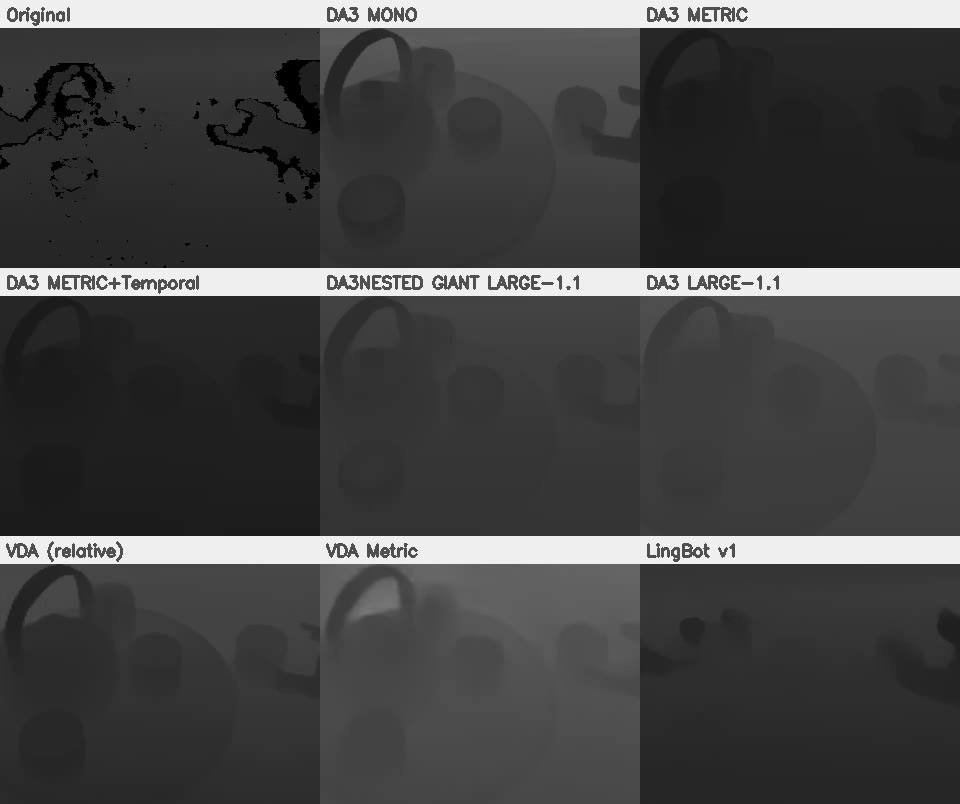
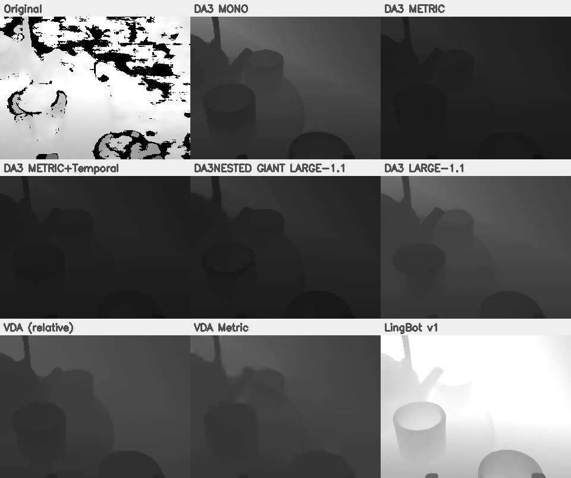
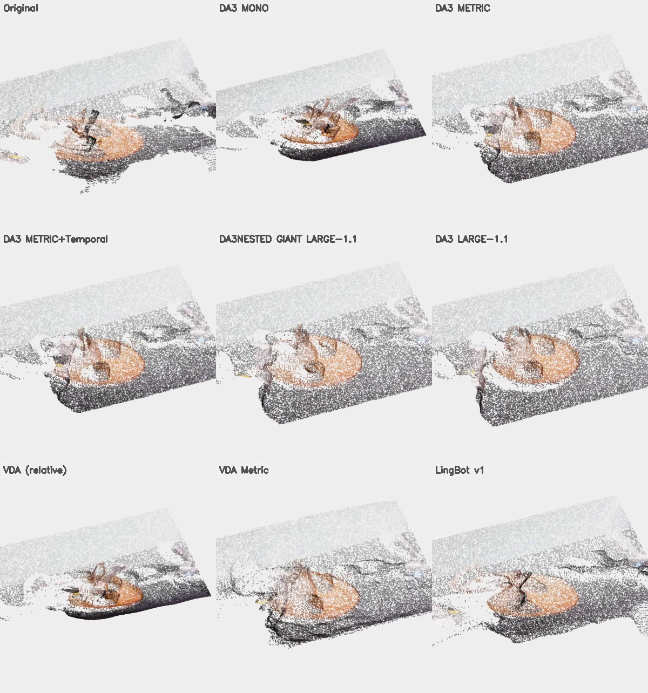
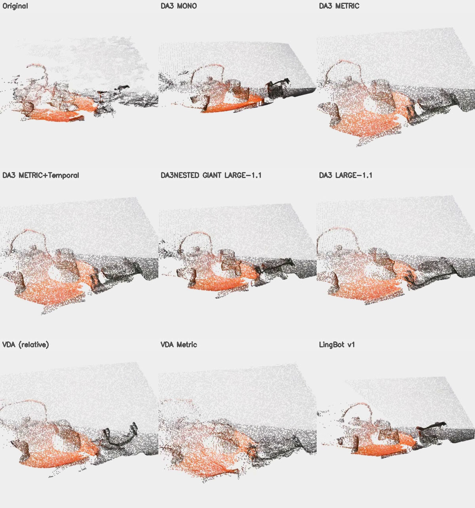
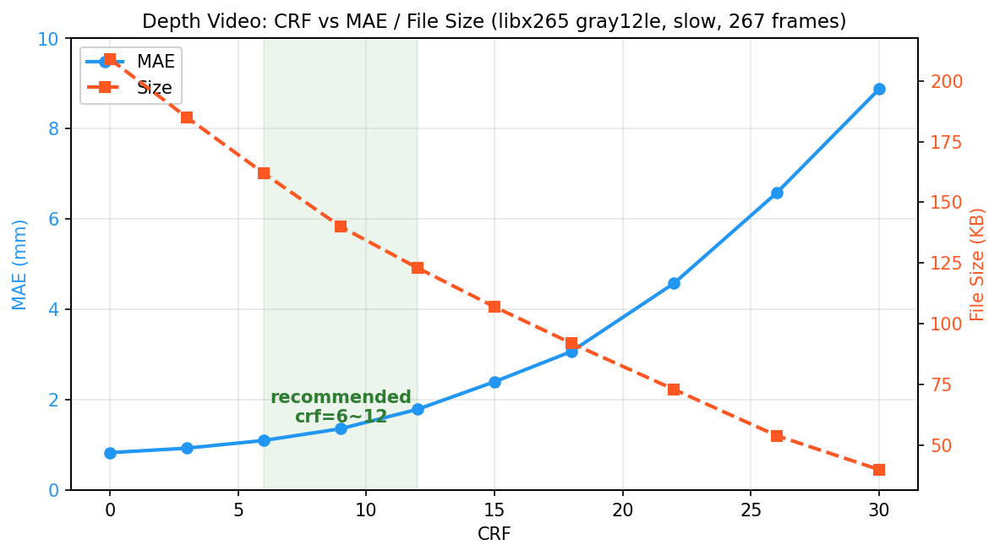
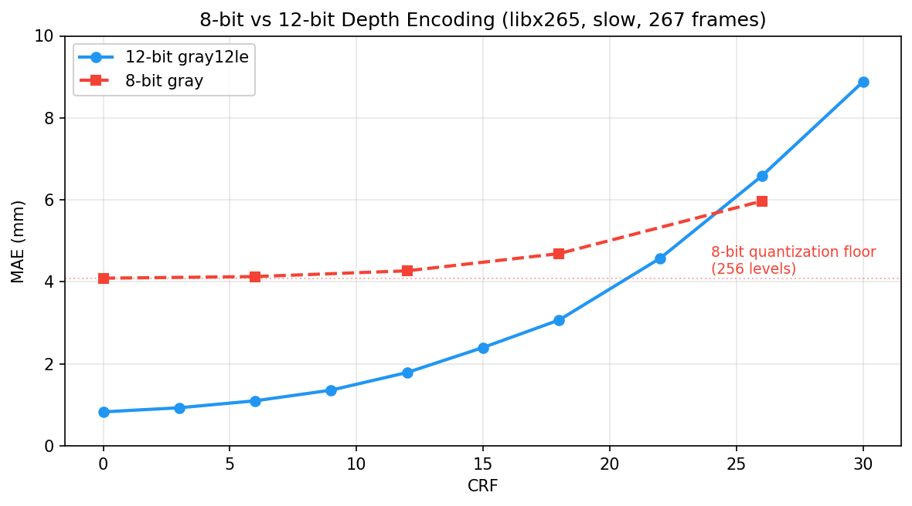
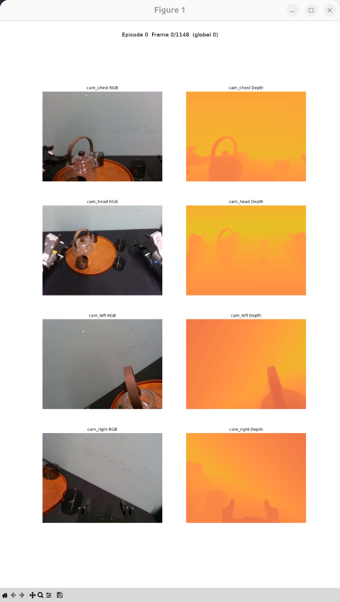
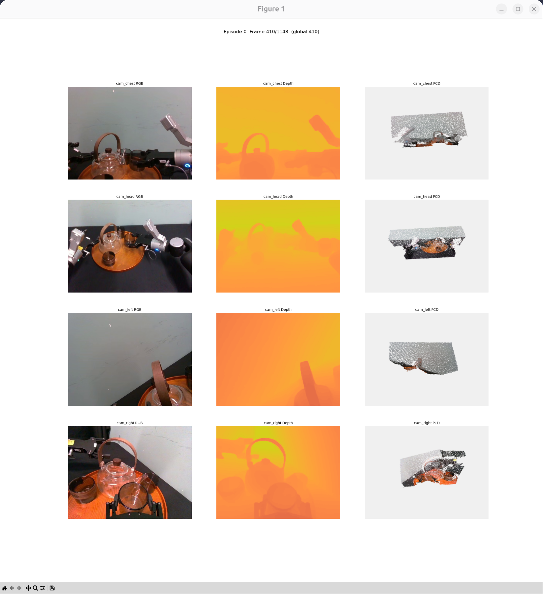

# RoboCOIN with Depth

为 LeRobot 机器人数据集自动生成高质量深度图与点云的工具集。支持多种 SOTA 深度估计策略，12-bit H.265 高效编码，完全兼容原生 LeRobot 读取。

## 策略对比

| 策略 | 原理 | 输入 | 绝对距离 | 精度 | 重建 | 帧间一致 | 时间(s) | 显存(MiB) | 评级 |
|------|------|------|:--:|:--:|:--:|:--:|--:|--:|:--:|
| DA3 MONO | ViT-L 单帧 DPT | RGB | ✗ | 中 | 中 | 低 | 2.0 | 7024 | ⭐⭐ |
| DA3 METRIC | ViT-L DPT, metric 训练 | RGB | ✓ | 高 | 高 | 低 | 2.0 | 7024 | ⭐⭐⭐ |
| **DA3 METRIC + Temporal** | **METRIC + EMA 平滑** | **RGB** | **✓** | **高** | **高** | **中** | **2.1** | **7024** | ⭐⭐⭐⭐ **（高效低资源首选）** |
| DA3 LARGE-1.1 | ViT-L 多帧 DualDPT | RGB | ✗ | — | 高 | 中 | 6.2 | 8612 | ⭐⭐ |
| **DA3 NESTED-GIANT-LARGE-1.1** | **ViT-g + ViT-L 嵌套** | **RGB** | **✓** | **最高** | **最高** | **高** | **12.1** | **15070** | ⭐⭐⭐⭐⭐ **（高精度首选）** |
| VDA | ViT-L 时序注意力, 32帧窗口 | RGB | ✗ | — | 中 | 高 | 4.7 | 10845 | ⭐⭐ |
| VDA Metric | VDA + metric 训练 | RGB | ✓ | 高 | 低 | 高 | 4.6 | 10845 | ⭐⭐ |
| LingBot-Depth v0.5 | RGB-D ViT 融合补全 | RGB+D | ✓ | 高 | 高 | 低 | 9.6 | 3754 | ⭐⭐⭐ |

> **注**: batch_size=16，推理100帧，测试环境为单卡 NVIDIA A800 80GB

**绝对距离**: ✓=物理距离(mm), ✗=无量纲相对深度，—=相对深度无精度可言

**重建精度**: 3D 点云几何一致性

**帧间一致**: 低=逐帧独立推理有抖动, 中=EMA平滑改善, 高=多帧模型内在一致

## 效果展示

### 深度图对比

| Head Camera | Right Camera |
|:--:|:--:|
|  |  |

### 3D 点云对比

| Head Camera | Right Camera |
|:--:|:--:|
|  |  |

### 总结

**深度估计 & 深度修补对比**：Head Camera 本身精度较低，即便采用深度修补策略（LingBot-Depth）也无法完全恢复精度，仍存在几何扭曲，此时推荐使用深度估计策略（DA3 METRIC + Temporal / DA3 NESTED-GIANT-LARGE-1.1）获得更高精度。而 Right Camera 本身精度较高，深度修补策略（LingBot-Depth）可在低成本下获得较好效果。

**绝对距离测量的必要性**：相对深度（✗）仅反映序数关系（A 比 B 近），无法用于几何测量，导致空间扭曲。metric 模型（✓）输出物理距离，3D 重建和机器人操作依赖绝对尺度。

**帧间一致性**：逐帧独立推理（DA3 MONO/METRIC、LingBot）产生时序抖动，在点云视频中表现为闪烁。EMA 平滑（METRIC+Temporal）以极低成本改善。多帧模型（DA3 LARGE/NESTED、VDA）内在一致。

## 视频编码原理

### 核心思路

将 16-bit 深度图以 **12-bit H.265 (gray12le)** 编码嵌入标准 LeRobot 数据集，利用视频帧间预测实现 **30:1~50:1** 的压缩比。

继承 `LeRobotDataset`，在 `add_frame` / `save_episode` 中拦截深度帧，绕过父类 Parquet 管线，单独通过 `ffmpeg + libx265` 编码为专用深度视频。解码时通过 `TorchCodec` 读取，结合 `episodes_stats.jsonl` 中的 per-episode 归一化参数恢复原始深度值。

### 关键设计

**gray12le 像素格式**

单通道 12-bit，无颜色空间转换，无色彩子采样损失。`gray12le` 每像素 2 字节（低 12 位有效），libx265 12-bit profile 原生支持。

**以毫米 (mm) 为单位，量程 0~4095mm，精度 1mm，完全覆盖常见机器人深度传感器。**

**恒定帧率**

输入输出均指定 `-r 30 -fps_mode cfr`，强制 CFR，保证帧严格对齐。

### 关键技术参数

| 特性 | 选择 | 原因 |
|------|------|------|
| 像素格式 | `gray12le` | 单通道 12-bit，无子采样 |
| 编码器 | `libx265 12-bit` | 帧间预测高效，原生 12-bit |
| GOP | 1 秒 (30 帧) | 平衡随机访问与压缩比 |
| B-frames | 关闭 (`bframes=0`) | 避免解码延迟 |
| CRF | 6~15 | 近乎无损 (MAE 1~2mm) |
| 容器 | `.mp4` | 通用，兼容 LeRobot |

### 压缩性能



以 267 帧 256×256 深度图（原始 16-bit PNG：3.5 MB），slow 预设下实测：

| CRF | MAE (mm) | 文件大小 (KB) | 压缩比 |
|--:|--:|--:|--:|
| 0 | 0.83 | 209 | 17:1 |
| 6 | 1.10 | 162 | 21:1 |
| 12 | 2.40 | 107 | 32:1 |
| 18 | 4.58 | 73 | 47:1 |
| 26 | 6.58 | 54 | 64:1 |
| 30 | 8.88 | 40 | 86:1 |

### 12-bit vs 8-bit



8-bit（256 级量化）在 CRF=0 时 MAE 已触底 4.1 mm — 这是量化精度的物理上限，继续降低 CRF 不再改善。12-bit（4096 级）可突破此瓶颈，CRF < 6 时 MAE < 1 mm，精度提升 **4 倍以上**。

量程 1m 精度可达 0.24 mm，量程 2m 精度可达 0.5 mm。

LeRobot 框架中通过 `TorchCodec` 自动解码，完美兼容原生读取，无需额外依赖。

## 安装

```bash
# 克隆仓库
git clone https://github.com/your_org/RoboCOIN-with-Depth
cd RoboCOIN-with-Depth

# 创建 conda 环境
conda create -n robocoin-depth python=3.11
conda activate robocoin-depth

# 安装 ffmpeg < 8，适配 torchcodec
conda install "ffmpeg<8" -c conda-forge

# 安装依赖
pip install robocoin

# 安装 PyTorch
# 为了适配 xformers，建议使用 torch 2.10.0 CUDA 12.8或13.0
pip install torch==2.10.0 torchvision==0.25.0 torchaudio==2.10.0 --index-url https://download.pytorch.org/whl/cu130
# 如果你的 NVIDIA 驱动低于 590，请安装 torch 2.10.0 CUDA 12.8
# pip install torch==2.10.0 torchvision==0.25.0 torchaudio==2.10.0 --index-url https://download.pytorch.org/whl/cu128
pip install xformers

# 安装 DA3 (从 third_party)
pip install -e third_party/Depth-Anything-3

# Torchcodec 版本必须高于 0.14.0，才能支持 gray12le
pip install -U torchcodec

# 对于其他策略，如 VDA 或 LingBot-Depth，请参考各自的安装说明
```

## 快速开始

假设你已经有一个 LeRobot 数据集，目录结构如下：
```bash
data/lerobot/dataset/
├── data
│   └── chunk-000
│       ├── episode_000000.parquet
│       ├── episode_000001.parquet
│       └── episode_000002.parquet
├── meta
│   ├── episodes.jsonl
│   ├── episodes_stats.jsonl
│   ├── info.json
│   └── tasks.jsonl
└── videos
    └── chunk-000
        ├── observation.images.cam_chest_rgb
        │   ├── episode_000000.mp4
        │   ├── episode_000001.mp4
        │   └── episode_000002.mp4
        ├── observation.images.cam_head_rgb
        ├── observation.images.cam_left_rgb
        └── observation.images.cam_right_rgb
```

接下来，运行以下命令为数据集添加深度视频，该命令使用 DA3 METRIC + Temporal 策略，生成高质量深度图和点云：

```bash
# 为已有 LeRobot 数据集添加深度
python scripts/add_depth_fs.py \
    --dataset-dir data/lerobot/dataset \
    --strategy da3 \
    --da3-chunk-size 16 \
    --da3-temporal-alpha 0.7
```

完成后，数据集目录下将添加深度视频，结构如：

```
data/lerobot/dataset/
├── data
│   └── chunk-000
│       ├── episode_000000.parquet
│       ├── episode_000001.parquet
│       └── episode_000002.parquet
├── meta
│   ├── episodes.jsonl
│   ├── episodes_stats.jsonl
│   ├── info.json
│   └── tasks.jsonl
└── videos
    └── chunk-000
        ├── observation.images.cam_chest_depth
        │   ├── episode_000000.mp4
        │   ├── episode_000001.mp4
        │   └── episode_000002.mp4
        ├── observation.images.cam_chest_rgb
        ├── observation.images.cam_head_depth
        ├── observation.images.cam_head_rgb
        ├── observation.images.cam_left_depth
        ├── observation.images.cam_left_rgb
        ├── observation.images.cam_right_depth
        └── observation.images.cam_right_rgb
```

深度视频已添加到每个摄像头的 `observation.images.*_depth` 文件夹中，**完全兼容原生 LeRobot 读取**。

```bash
# 原生 LeRobot（兼容开箱即用）
python scripts/load_lerobot.py --repo-id dataset --native

# 增强版（含点云 PCD）
python scripts/load_lerobot.py --repo-id dataset
```

**快捷键**: 
- 帧切换：`← →` ±1帧, `Shift+← →` ±10帧, `Ctrl+← →` ±100帧
- `↑ ↓` 切 episode
- 点云操控: `w/s` 俯仰, `a/d` 方位, `q` 退出

| 原生 (RGB + Depth) | 增强版 (RGB + Depth + PCD) |
|:--:|:--:|
|  |  |

## 使用

详细参数通过 `--help` 查看。

### `add_depth_fs.py` — 文件系统级增强（快速，V2.1 格式）

```bash
python scripts/add_depth_fs.py --dataset-dir data/lerobot/dataset --strategy da3
```

| 参数 | 说明 | 默认 |
|------|------|------|
| `--dataset-dir` | 数据集根目录 | 必填 |
| `--strategy` | da3 / vda | da3 |
| `--fps` / `--crf` / `--preset` | 编码参数 | 30/15/medium |
| `--normalize` | min-max 归一化 | False |
| `--da3-*` | DA3 模型/分辨率/chunk/overlap/temporal | — |
| `--vda-*` | VDA encoder/checkpoint/input/metric/invert/fp32 | — |

### `add_depth_to_lerobot.py` — API 增强 + 点云（通用格式）

```bash
python scripts/add_depth_to_lerobot.py --repo-id org/dataset --output-repo-id org/dataset_depth --save-pcd
```

| 参数 | 说明 | 默认 |
|------|------|------|
| `--repo-id` / `--root` | 源数据集 | 必填 / data/lerobot |
| `--output-repo-id` / `--output-root` | 输出目标 | `{id}_with_depth` / 同源 |
| `--cameras` | head/right/left/chest | 全部 |
| `--strategy` | da3 / vda | da3 |
| `--save-pcd` / `--normalize` | 逐帧点云 / 归一化 | False |
| `--da3-*` / `--vda-*` | 同上 | — |

### `create_lerobot_dataset_with_depth.py` — H5 → LeRobot

```bash
python scripts/create_lerobot_dataset_with_depth.py \
    --h5-dir data/raw/xxx --repo-id org/dataset --repair --sample-frames 200
```

| 参数 | 说明 | 默认 |
|------|------|------|
| `--h5-dir` / `--repo-id` | H5 目录 / 输出 ID | 必填 |
| `--root` / `--fps` / `--task` | 输出根/帧率/任务 | data/lerobot / 30 / arrange_teaset |
| `--sample-frames` | 均匀采样 (0=全部) | 0 |
| `--repair` / `--repair-strategy` | 启用修复 / da3,vda,lingbot | False / da3 |
| `--da3-*` / `--vda-*` / `--lingbot-*` | 策略参数 | — |
| `--normalize-depth` | min-max 归一化 | False |
| `--image-writer-threads` | 并行编码线程数 | 16 |

### `load_lerobot.py` — 可视化

```bash
python scripts/load_lerobot.py --repo-id test --camera all
```

| 参数 | 说明 | 默认 |
|------|------|------|
| `--repo-id` / `--root` | 数据集 ID / 根目录 | 必填 / data/lerobot |
| `--episode` / `--frame` | episode 索引 / 帧索引 | 0 / 0 |
| `--camera` | head / right / all | all |

## 致谢

感谢以下开源项目提供的基础设施：

- [LeRobot](https://github.com/huggingface/lerobot) — 机器人数据集标准框架
- [TorchCodec](https://github.com/pytorch/torchcodec) — PyTorch 原生视频编解码库
- [ffmpeg](https://ffmpeg.org) / [x265](https://www.videolan.org/developers/x265.html) — H.265 编码器，gray12le 格式支持
- [LIBERO](https://github.com/Lifelong-Robot-Learning/LIBERO) — 示例数据集来源